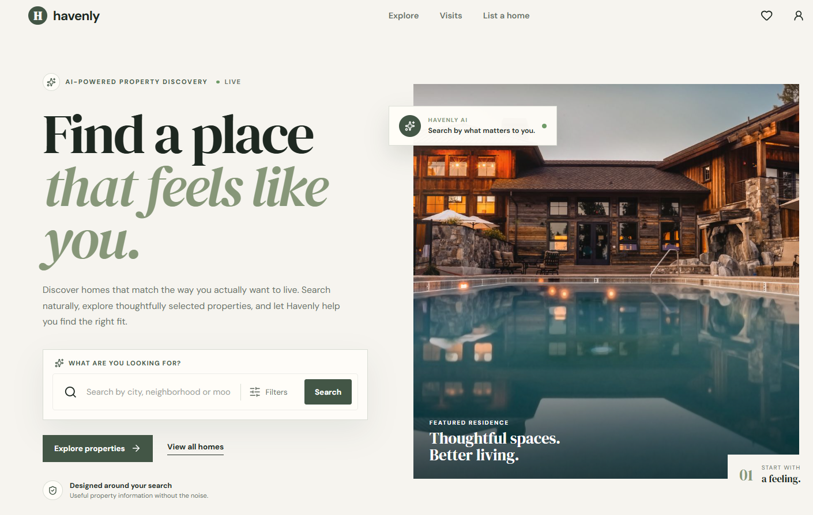
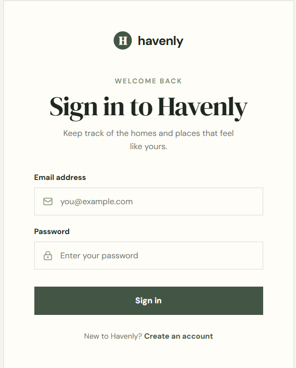
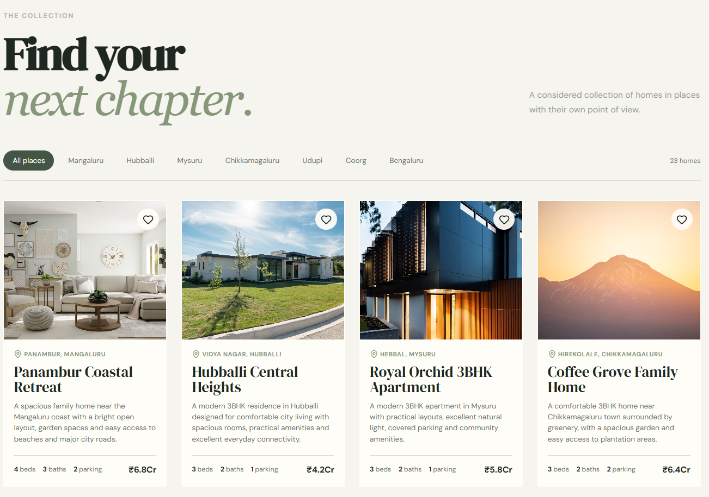
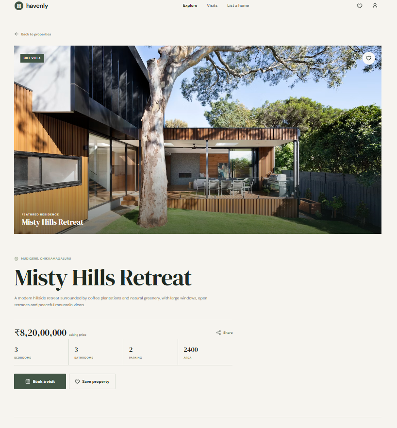
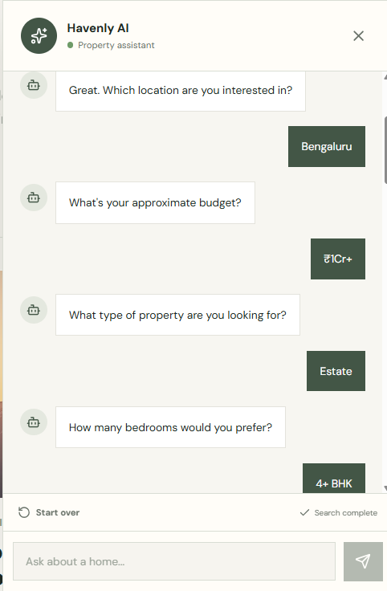
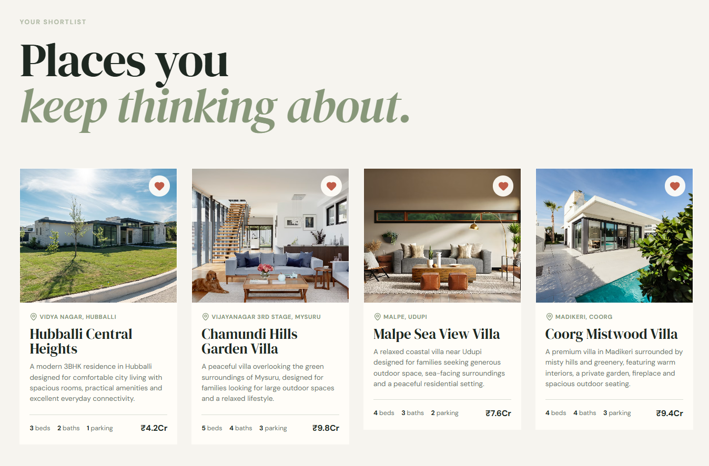
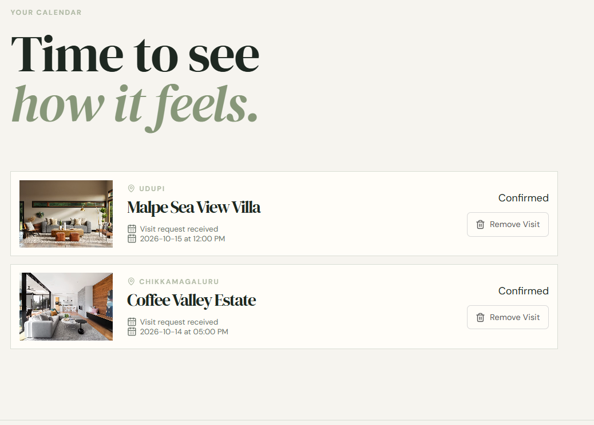

# 🏡 Havenly — Real Estate Website with AI Chatbot

Havenly is a full-stack real estate web application that helps users discover properties, search and filter listings, view detailed property information, save favorite properties, book property visits, and interact with an AI-powered property assistant.

The application combines a React frontend, Node.js/Express backend, MongoDB Atlas, Prisma ORM, and Google Gemini API to provide an intelligent property discovery experience.

---

## 📸 Screenshots

<table>
  <tr>
    <td width="50%">
      
      <p align="center"><strong>Home Page</strong></p>
    </td>
    <td width="50%">
      
      <p align="center"><strong>Sign In</strong></p>
    </td>
  </tr>
  <tr>
    <td width="50%">
      
      <p align="center"><strong>Properties</strong></p>
    </td>
    <td width="50%">
      
      <p align="center"><strong>Property Details</strong></p>
    </td>
  </tr>
  <tr>
    <td width="50%">
      
      <p align="center"><strong>AI Chatbot</strong></p>
    </td>
    <td width="50%">
      
      <p align="center"><strong>Favorites</strong></p>
    </td>
  </tr>
  <tr>
    <td colspan="2" align="center">
      
      <p><strong>Bookings</strong></p>
    </td>
  </tr>
</table>

---

## ✨ Features

### 🏠 Property Discovery

* Browse available properties from different locations.
* View properties in a clean card-based interface.
* Search and filter properties based on user requirements.
* View property information such as:

  * Property type
  * Price
  * Location
  * Bedrooms
  * Bathrooms
  * Parking
  * Area
  * Furnishing
  * Amenities
  * Availability

### 🤖 AI Property Assistant

Havenly includes an AI-powered chatbot that helps users search for properties using natural language.

Users can ask questions such as:

```text
Show me villas in Bangalore under 2 crore
```

```text
Find a 3 BHK apartment in Whitefield
```

```text
Show properties near the beach
```

```text
I need a property with parking and a swimming pool
```

The chatbot analyzes the user's request and combines AI responses with the application's property database.

### 🧠 Intelligent Property Filtering

A custom filtering engine processes natural-language property requirements.

It supports:

* Location
* City
* Property type
* Budget
* Bedrooms / BHK
* Bathrooms
* Parking
* Amenities
* Beach/coastal properties
* Coffee estates / plantations
* Swimming pools
* Gyms
* Gardens
* Security
* Clubhouses
* Balconies
* Terraces
* Lifts

### ❤️ Favorites

Users can save properties to their favorites.

Features include:

* Add property to favorites
* Remove property from favorites
* View saved properties
* Animated removal interaction

### 📅 Property Visit Booking

Users can book visits for properties.

Features include:

* Select a visit date
* Book a property visit
* View booked visits
* Cancel bookings
* Prevent duplicate bookings

### 🏡 Property Details

Each property has a dedicated details page containing:

* Property gallery
* Property description
* Price
* Property specifications
* Amenities
* Location
* Nearby places
* Map
* Property information
* Visit booking
* Save property option
* Share option

### 🗺️ Property Location

Property locations are displayed using OpenStreetMap.

The application uses stored latitude and longitude information for property locations and displays the corresponding area on the map.

### 🔐 User Authentication

The application provides:

* User registration
* User login
* User-specific favorites
* User-specific bookings

### 🏘️ List a Property

The application includes a property listing interface where users can enter property information such as:

* Property title
* Description
* Price
* Address
* City
* Country
* Property facilities
* Property image

### 📱 Responsive Interface

The frontend is designed to work across:

* Desktop
* Laptop
* Tablet
* Mobile devices

---

## 🛠️ Technology Stack

### Frontend

* React.js
* JavaScript
* React Router
* Vite
* CSS
* Lucide React Icons
* Fetch-based API communication

### Backend

* Node.js
* Express.js
* REST APIs

### Database

* MongoDB Atlas
* Prisma ORM

### Artificial Intelligence

* Google Gemini API
* Custom property filtering engine
* Natural-language property search

### Maps

* OpenStreetMap

### Development Tools

* Visual Studio Code
* Git
* GitHub
* npm

---

## 🏗️ Application Architecture

```text
                         ┌──────────────────────┐
                         │        User          │
                         └──────────┬───────────┘
                                    │
                                    ▼
                         ┌──────────────────────┐
                         │   React Frontend     │
                         │      + Vite          │
                         └──────────┬───────────┘
                                    │
                              REST API
                                    │
                                    ▼
                         ┌──────────────────────┐
                         │  Express.js Backend  │
                         │      Node.js         │
                         └───────┬───────┬──────┘
                                 │       │
                       ┌─────────┘       └─────────────┐
                       ▼                               ▼
              ┌─────────────────┐             ┌─────────────────┐
              │   Prisma ORM    │             │   Gemini API    │
              └────────┬────────┘             └─────────────────┘
                       │
                       ▼
              ┌─────────────────┐
              │  MongoDB Atlas  │
              └─────────────────┘
```

---

## 🔄 Application Workflow

### Property Discovery

```text
User
  ↓
Properties Page
  ↓
Search / Filter
  ↓
Frontend API Request
  ↓
Express Backend
  ↓
Prisma
  ↓
MongoDB Atlas
  ↓
Property Results
  ↓
React Property Cards
```

### AI Property Search

```text
User Question
      ↓
AI Chatbot
      ↓
Express Chat API
      ↓
Gemini API
      ↓
Property Requirement Detection
      ↓
Custom Filter Engine
      ↓
MongoDB Property Data
      ↓
Matching Properties
      ↓
AI Response + Property Cards
```

### Favorites

```text
User
 ↓
Click Favorite
 ↓
Frontend
 ↓
User API
 ↓
Express
 ↓
Prisma
 ↓
MongoDB
 ↓
Favorite Updated
```

### Property Booking

```text
User
 ↓
Property Details
 ↓
Select Visit Date
 ↓
Book Visit
 ↓
Backend API
 ↓
MongoDB
 ↓
Booking Saved
```

---

## 📂 Project Structure

```text
Real-Estate-Website-with-AI-Chatbot/
│
├── client/
│   │
│   ├── index.html
│   ├── package.json
│   ├── vite.config.js
│   │
│   └── src/
│       ├── App.jsx
│       ├── main.jsx
│       │
│       ├── assets/
│       │   └── hero.png
│       │
│       ├── components/
│       │   ├── Chatbot.jsx
│       │   ├── Footer.jsx
│       │   ├── Hero.jsx
│       │   ├── LoadingSpinner.jsx
│       │   ├── Navbar.jsx
│       │   ├── PropertyCard.jsx
│       │   └── SearchBar.jsx
│       │
│       ├── context/
│       │   └── AuthContext.jsx
│       │
│       ├── pages/
│       │   ├── AddProperty.jsx
│       │   ├── Bookings.jsx
│       │   ├── Favorites.jsx
│       │   ├── Home.jsx
│       │   ├── Login.jsx
│       │   ├── Properties.jsx
│       │   ├── PropertyDetails.jsx
│       │   └── Register.jsx
│       │
│       ├── services/
│       │   ├── api.js
│       │   ├── chatService.js
│       │   ├── propertyService.js
│       │   └── userService.js
│       │
│       └── styles/
│           ├── auth.css
│           ├── chatbot.css
│           ├── global.css
│           ├── home.css
│           ├── properties.css
│           └── property-details.css
│
├── server/
│   │
│   ├── index.js
│   ├── package.json
│   ├── vercel.json
│   │
│   ├── config/
│   │   ├── auth0Config.js
│   │   └── prismaConfig.js
│   │
│   ├── controllers/
│   │   ├── resdCntrl.js
│   │   └── userCntrl.js
│   │
│   ├── data/
│   │   └── Residency.json
│   │
│   ├── prisma/
│   │   ├── schema.prisma
│   │   └── seed.js
│   │
│   ├── routes/
│   │   ├── chatRoute.js
│   │   ├── residencyRoute.js
│   │   └── userRoute.js
│   │
│   └── utils/
│       └── filterEngine.js
│
├── screenshots/
│   ├── homepage.png
│   ├── signin.png
│   ├── properties.png
│   ├── propertiesdetails.png
│   ├── chatbot.png
│   ├── favorites.png
│   └── bookings.png
│
├── .gitignore
└── README.md
```

---

## 🗄️ Database Design

The application uses MongoDB Atlas with Prisma ORM.

### User

The user collection stores information such as:

```text
User
├── id
├── email
├── name
├── bookedVisits
├── favResidenceiesID
└── residencies
```

### Residency

The residency collection stores property information such as:

```text
Residency
├── id
├── title
├── description
├── propertyType
├── price
├── address
├── country
├── city
├── image
├── images
├── facilities
├── area
├── plotArea
├── yearBuilt
├── furnishing
├── amenities
├── latitude
├── longitude
├── nearbyPlaces
├── availability
├── status
├── userEmail
├── createdAt
└── updatedAt
```

---

## 🔌 REST API Endpoints

### Residency APIs

#### Create Property

```text
POST /api/residency/create
```

Creates a new property listing.

#### Get All Properties

```text
GET /api/residency/allresd
```

Returns all available properties.

#### Get Property

```text
GET /api/residency/:id
```

Returns details of a specific property.

### User APIs

#### Register

```text
POST /api/user/register
```

Creates a user account.

#### Book Visit

```text
POST /api/user/bookVisit/:id
```

Books a visit for a property.

#### Get Bookings

```text
POST /api/user/allBookings
```

Returns the user's booked visits.

#### Cancel Booking

```text
POST /api/user/removeBooking/:id
```

Cancels a property visit.

#### Add / Remove Favorite

```text
POST /api/user/toFav/:rid
```

Adds or removes a property from favorites.

#### Get Favorites

```text
POST /api/user/allFav
```

Returns the user's favorite properties.

---

## 🤖 AI Chatbot

The Havenly AI assistant uses Google Gemini together with a custom property filtering engine.

Instead of relying only on the AI model to generate answers, the application connects the AI request to the actual property database.

For example:

```text
User:

"Show me 3 BHK villas in Bangalore under 2 crore"
```

The application identifies:

```text
Location      → Bangalore
Property Type → Villa
Bedrooms      → 3+
Budget        → ₹2 Crore or below
```

The filtering engine then searches the property database and returns matching properties.

This helps the chatbot provide property recommendations based on actual application data rather than generating imaginary listings.

---

## 🔎 Supported AI Search Examples

Users can search using natural language such as:

```text
Find villas in Bangalore
```

```text
Show me properties under 1 crore
```

```text
Find a 3 BHK apartment
```

```text
Show properties with parking
```

```text
Find properties with a swimming pool
```

```text
Show beach properties in Mangalore
```

```text
Find coffee estates in Chikkamagaluru
```

```text
Show properties near Whitefield
```

---

## 🌍 Property Locations

The application currently contains property data from locations including:

* Bengaluru
* Mysuru
* Mangaluru
* Udupi
* Chikkamagaluru
* Coorg
* Hubballi

Property coordinates are stored in the database and used for displaying the corresponding area through OpenStreetMap.

---

## 🚀 Getting Started

### 1. Clone the Repository

```bash
git clone https://github.com/Adarshaachary/havenly-real-estate-ai.git
```

Move into the project:

```bash
cd havenly-real-estate-ai
```

---

## 💻 Frontend Setup

Move into the client directory:

```bash
cd client
```

Install dependencies:

```bash
npm install
```

Start the development server:

```bash
npm run dev
```

The frontend will normally run at:

```text
http://localhost:5173
```

---

## ⚙️ Backend Setup

Open another terminal and move to the server directory:

```bash
cd server
```

Install dependencies:

```bash
npm install
```

Configure the required environment variables in the server `.env` file.

Then start the backend using the development command configured in `server/package.json`.

---

## 🔐 Environment Variables

The application uses environment variables for sensitive configuration.

Example:

```env
DATABASE_URL=your_mongodb_connection_string
GEMINI_API_KEY=your_gemini_api_key
```

Do not commit actual API keys, database passwords, or other private credentials to GitHub.

---

## 🌱 Database Seeding

The project includes a Prisma seed script for creating sample users and property data.

After configuring the database, the seed process can be used to populate the application with sample properties.

The seeded dataset contains multiple properties across different cities and property types.

---

## 🧪 Testing the Application

The main application flow can be tested using:

```text
1. Register
      ↓
2. Login
      ↓
3. Home
      ↓
4. Properties
      ↓
5. Search / Filter
      ↓
6. Open Property
      ↓
7. View Property Details
      ↓
8. Save Favorite
      ↓
9. Book Visit
      ↓
10. View Favorites
      ↓
11. View Bookings
      ↓
12. Cancel Booking
```

The AI chatbot can separately be tested using natural-language property searches.

---

## 📌 Current Project Status

### Implemented

* ✅ React frontend
* ✅ Responsive UI
* ✅ Property listing
* ✅ Property search and filtering
* ✅ Property details
* ✅ Favorites
* ✅ Booking system
* ✅ Booking cancellation
* ✅ User registration
* ✅ User login
* ✅ MongoDB Atlas integration
* ✅ Prisma ORM
* ✅ Express REST APIs
* ✅ OpenStreetMap integration
* ✅ Gemini AI integration
* ✅ Natural-language property search
* ✅ Custom property filtering engine
* ✅ AI chatbot
* ✅ GitHub repository
* ✅ Project screenshots

### Remaining / Future Improvements

* 🔄 Production-ready authentication and authorization
* 🔄 Secure user identity handling on backend APIs
* 🔄 Complete production-ready property listing flow
* 🔄 Final end-to-end testing
* 🔄 Production deployment
* 🔄 Improved error handling and validation
* 🔄 Property image upload/storage
* 🔄 Advanced property management
* 🔄 Production billing or premium features

---

## 🔮 Future Enhancements

Possible future improvements include:

* User profile management
* Admin dashboard
* Property owner dashboard
* Property editing and deletion
* Image upload using cloud storage
* Advanced property comparison
* Mortgage / EMI calculator
* More advanced AI recommendations
* AI-based property summaries
* Property availability tracking
* Email notifications
* Push notifications
* Property reviews and ratings
* Advanced map-based property search
* Production deployment

---

## 🎯 Learning Outcomes

Through this project, I worked with:

* React component architecture
* React Router
* REST API development
* Node.js and Express.js
* MongoDB database integration
* Prisma ORM
* CRUD operations
* User-specific data
* Authentication concepts
* API integration
* Google Gemini API
* Natural-language property search
* Custom filtering logic
* Map integration
* Git and GitHub
* Full-stack application architecture
* Responsive web development

---

## 💼 Resume Description

### Havenly — Real Estate Website with AI Chatbot

**Technologies:** React.js, JavaScript, Node.js, Express.js, MongoDB, Prisma, Gemini API, OpenStreetMap

* Developed a full-stack real estate platform using React.js, Node.js, Express.js, Prisma, and MongoDB Atlas, supporting property discovery, filtering, favorites, visit bookings, and detailed property information.
* Integrated Google Gemini API with a custom property-filtering engine to enable natural-language property searches based on location, budget, property type, bedrooms, parking, and amenities.
* Implemented REST APIs and database operations for property listings, user data, favorites, and bookings, with OpenStreetMap-based property location visualization.
* Built a responsive component-based frontend with React Router, reusable components, API services, and custom CSS, and managed the project using Git and GitHub.

---

## 👨‍💻 Developer

**Adarsha Acharya**

Information Science & Engineering Student
Atria Institute of Technology
Bengaluru, Karnataka, India

### GitHub

[Adarsha Acharya](https://github.com/Adarshaachary)

### Project Repository

[Havenly — Real Estate Website with AI Chatbot](https://github.com/Adarshaachary/havenly-real-estate-ai)

---

## 📄 License

This project is intended for educational, portfolio, and demonstration purposes.
